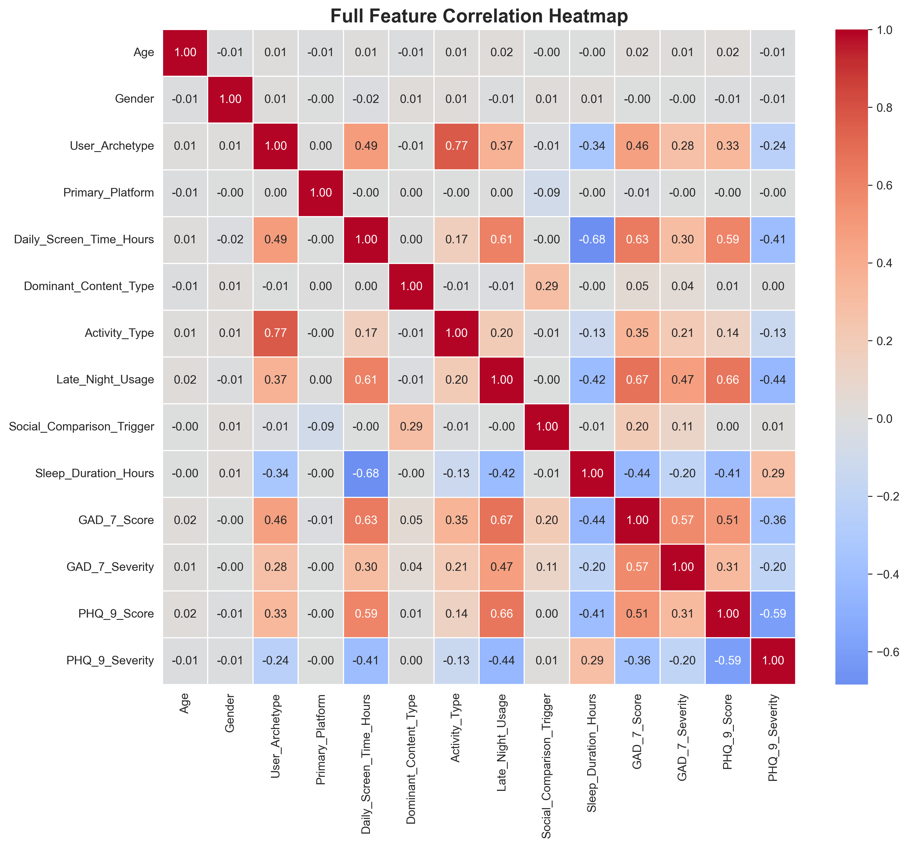
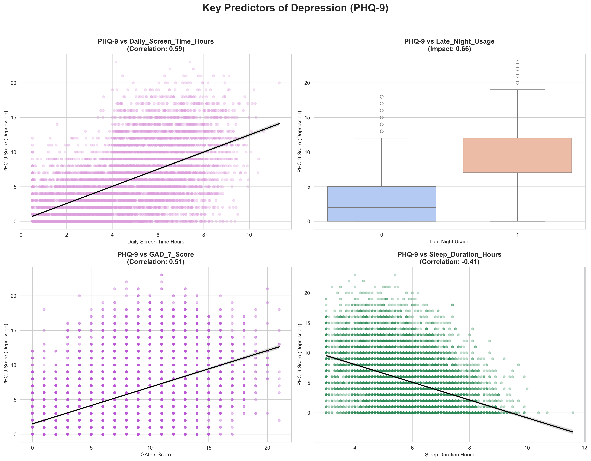
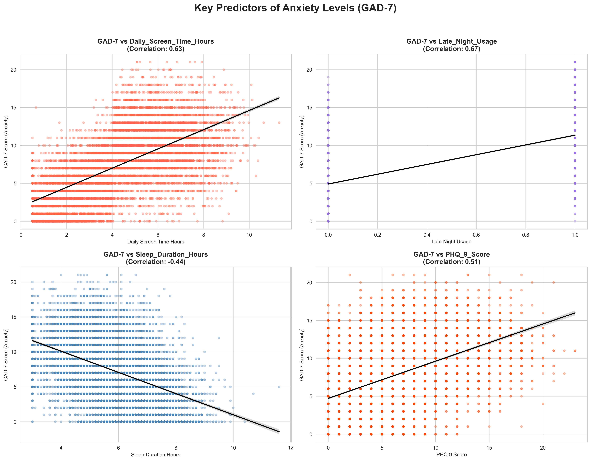
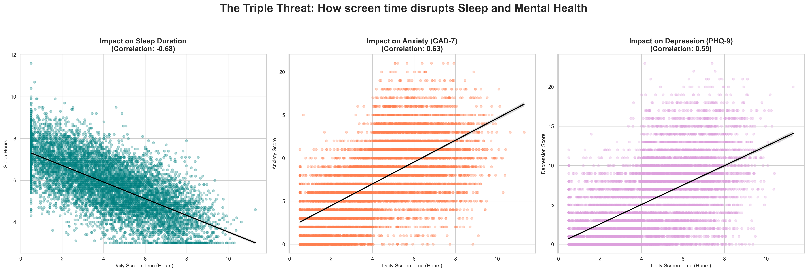

# Social Media Habits & Mental Health  
Statistical analysis of PHQ-9 and GAD-7 scores in relation to screen time and sleep patterns using Python.   

**Project Overview**  
This project analyzes the relationship between social media usage and mental health outcomes, specifically focusing on Anxiety (GAD-7) and Depression (PHQ-9). Using a dataset of 8,000 users, the goal was to identify whether the platform, the content, or the behavioral habits (like sleep and screen time) have the most significant impact on psychological well-being.  

**Key Findings**  

My analysis reached several important conclusions:  
•	Sleep: A strong negative correlation (-0.68) was found between Daily Screen Time and Sleep Duration. This suggests that increased digital consumption directly displaces rest, which is a critical factor for mental recovery.  
•	Predictors of Depression (PHQ-9): Late Night Usage (0.66) and Daily Screen Time (0.59) showed the strongest positive correlations with depression scores. This indicates that nighttime engagement with devices is a primary risk factor for depressive symptoms.  
•	Predictors of Anxiety (GAD-7): Significant drivers of anxiety scores include Late Night Usage (0.67) and Daily Screen Time (0.63).  
•	Comorbidity: A moderate positive correlation (0.51) between PHQ-9 and GAD-7 scores confirms the frequent overlap (comorbidity) of anxiety and depression symptoms in the studied population.  
•	Quantity over Quality: Interestingly, Social Platform and Content Type (e.g., TikTok vs. YouTube, or Gaming vs. Self-help) showed no significant correlation with mental health scores. This suggests that how much and when a person uses technology impacts mental health far more than the specific platform or content they consume.   

**Visualizations & Analysis Steps**  
1. Users Overview  
•	Gender & Age Distribution: Analyzed the diversity of the dataset to ensure results represent different groups.  
•	User Archetypes: Identified different types of users based on their engagement levels.  
2. Platform & Content Analysis  
•	The "Zero Correlation" Discovery: Used boxplots and density plots to show that the specific platform (Instagram, TikTok, etc.) and content type (Gaming, News, Comedy) do not significantly change depression or anxiety scores.  
3. Mental Health Severity (GAD-7 & PHQ-9)  
•	Severity Distribution: Created bar charts showing the percentage of users in each category (Minimal, Mild, Moderate, Severe).  
•	PHQ-9 Score Density: Visualized the spread of depression scores across different content categories.  
4. Correlation & Multivariate Analysis  
•	Full Feature Heatmap: A correlation matrix used to identify the strongest relationships between variables.  
•	Pairplot Analysis: Conducted a multivariate analysis to observe distributions and pairwise correlations between all numerical health metrics.  
5. Key Predictors (Regression Analysis)  
•	The "Triple Threat" Plots: Focused on the impact of Daily Screen Time on:  
    Sleep Duration (Strong negative correlation: -0.68)  
    Anxiety (GAD-7) (Correlation: 0.63)  
    Depression (PHQ-9) (Correlation: 0.59)  
•	Late-Night Usage Impact: Used boxplots to demonstrate how device use before bed acts as a major risk factor for mental distress.  

**Technologies Used**  
•	Python (Data Analysis & Manipulation)  
•	Pandas (Data Cleaning & Feature Engineering)  
•	Seaborn & Matplotlib (Advanced Data Visualization)  
•	Scikit-learn (Label Encoding & Preprocessing)  

**Key Conclusions**  
•	Habits > Content: When and how much you use social media is far more important for your health than what you watch.  
•	Sleep is the Mediator: The data proves that high screen time leads to sleep loss, which is the primary cause of increased anxiety and depression scores.  
•	Critical Factor: Late-night usage is the strongest predictor of high PHQ-9 and GAD-7 scores (impact of 0.66-0.67).  

**Recommendations**
Based on the data, I propose the following "Digital Hygiene" steps:  
•	Digital Sunset: Stop screen usage 60-90 minutes before sleep to protect mental health.  
•	Time Management: Limit daily screen time to prevent the displacement of biological sleep.  
